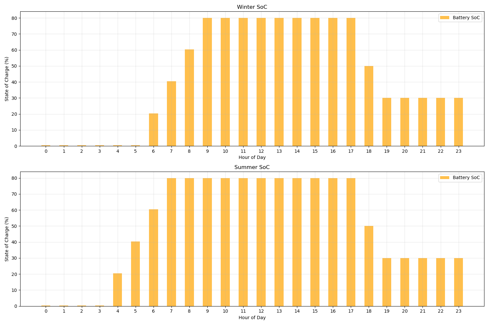

---

# Smart Home Energy Management

## Table of Contents
1. [Introduction](#introduction)
2. [Instructions](#instructions)
3. [Data Requirements](#data-requirements)
4. [Installation](#installation)
5. [Usage](#usage)
6. [Examples](#examples)

## Introduction

This project presents a **Smart Home Energy Management System** designed to optimize power consumption thus reduce energy costs by integrating renewable energy sources and load shifting. Key features of the system include:

- **Battery Management**  
  The system integrates a **battery** with a capacity equal to half of the home’s maximum peak load. For instance, if the peak load is **6 kW**, the battery capacity will be **3 kWh**. The charging and discharging rates are optimized at **20%** (0.6 kW for a 3 kWh battery) and **30%** (0.9 kW for a 3 kWh battery), respectively.  
  - The **battery supplies power during peak hours** (17:00 - 22:00).  
  - It will recharge when the **State of Charge (SoC)** drops below **50%** and is capped at a **maximum SoC of 80%**.  
  - **Battery usage is halted** once the SoC reaches 30%, ensuring the system's longevity.

- **Solar Panel Integration**  
  By incorporating **photovoltaic (PV) panels**, the system harnesses **renewable energy**, reducing reliance on grid power and lowering the environmental impact.

- **Load Shifting**  
  To optimize energy usage, the system implements **load shifting**. When the home's energy consumption exceeds a set threshold, non-essential loads are **shifted outside peak hours** (17:00 - 22:00) based on their priority. This helps to:
  - Lower peak demand and **reduce overall energy costs**.  
  - Ensure **essential devices** continue to run during peak times, while non-critical devices are deferred.

## Instructions

1. Run the program.
2. Select a load profile and a meteorological data set.
3. Set the threshold value.
4. Press "Analyze".

The program will calculate:
- Cost savings with and without load shifting.
- Cost savings from PV panels

## Data Requirements

- **Electric Load Profile**
- **Meteorological Data**

## Installation

1. Clone the repository:
   ```bash
   git clone https://github.com/EmirKahraman/Smart_Home.git
   ```
2. Navigate to the project directory:
   ```bash
   cd Smart_Home
   ```
3. Install the required dependencies:
   ```bash
   pip install -r requirements.txt
   ```
   
## Usage

Execute the main program:
```bash
python main.py
```

## Examples
These values were calculated based on the load_profile_v3.xlsx and meteorological_data.csv

##### Solar Irradiation
The solar irradiation data was extracted from the meteorological_data.csv file, and the average irradiation was calculated for the summer and winter months. 
<p align="center">
  
  <br>
  <em>Figure 1: Daily solar irradiation profile</em>
</p>

##### Battery Status
The battery charges when solar irradiation is available and discharges during peak demand hours.
<p align="center">
  
  <br>
  <em>Figure 2: Battery state of charge over time</em>
</p>

#### Thresholds
Thresholds represent specific values set to analyze system behavior and outputs. The program calculates results and cost savings for the following threshold levels:

##### Threshold 3
<p align="center">
  
  <br>
  <em>Figure 3: System behavior for threshold level 3</em>
</p>

<p align="center">
  
  <br>
  <em>Figure 4: Cost savings for threshold level 3</em>
</p>

##### Threshold 4
<p align="center">
  
  <br>
  <em>Figure 5: System behavior for threshold level 4</em>
</p>

<p align="center">
  
  <br>
  <em>Figure 6: Cost savings for threshold level 4</em>
</p>

##### Threshold 5
<p align="center">
  
  <br>
  <em>Figure 7: System behavior for threshold level 5</em>
</p>

<p align="center">
  
  <br>
  <em>Figure 8: Cost savings for threshold level 5</em>
</p>

##### Threshold 6
<p align="center">
  
  <br>
  <em>Figure 9: System behavior for threshold level 6</em>
</p>

<p align="center">
  
  <br>
  <em>Figure 10: Cost savings for threshold level 6</em>
</p>
